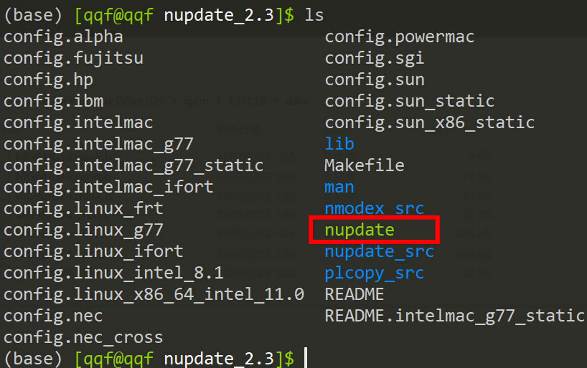

# nupdate安装

使用SGCM之前需要先安装nupdate，nupdate的安装包在SGCM根目录下，我用的是nupdate_2.3.tar.gz。我用的是intel编译器，需要利用到nupdate安装包中`config.linux_intel_8.1`这个config文件。为此，需要将ARCH环境变量设置为linux_intel_8.1：

```shell
export ARCH="linux_intel_8.1"
make nupdate
```

然后就可以看到有个名为nupdate的可执行文件出现了



不过这样编译出来的总有问题，所以说还有种办法，就是直接用网上提供的二进制文件：

<http://www.met.reading.ac.uk/~jeff/nupdate/>

# 编译

