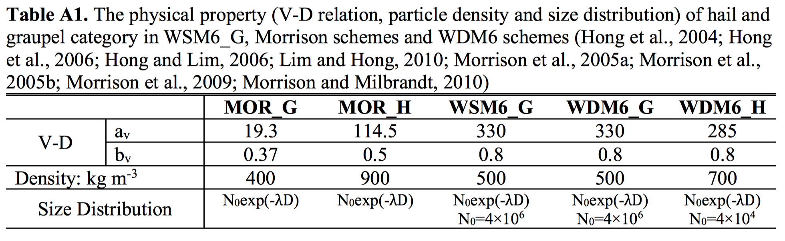
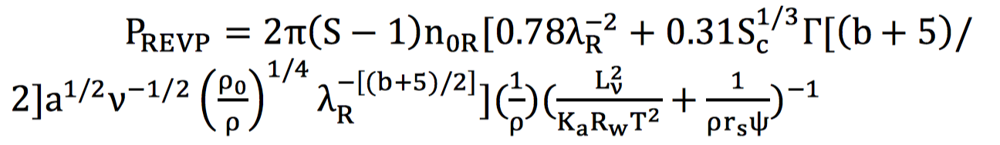
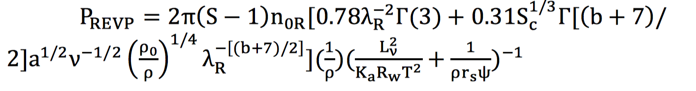

# Comparision-of-Microphysics-Schemes

My master's degree thesis is about the sensitivity of simulated squall line length to bulk microphysics schemes. Here, I summarize some basic features of microphysics schemes I have used before. Hope this will be helpful in the future.

## The Lin scheme

The Lin scheme is a single moment scheme that performs a mixed phase saturation adjustment and does not permit supersaturation with respect to ice at temperatures colder than -40°C (Lin et al. 1983). It prognoses mass mixing ratio of cloud droplet, rain, ice, snow and graupel. All the particles are assumed to follow the exponential size distribution. The mass-weighted mean terminal velocity of rain, snow and graupel is used in the Lin scheme. As the Lin scheme is a mature scheme, some new schemes are developed based on it, like the SBU-YLIN scheme (Lin and Colle 2011).

## The Thompson scheme

The Thompson scheme is a double moment scheme, which prognoses both mass and number mixing ratio of ice and rain, while only prognoses only the mass mixing ratio of cloud droplets, snow and a hybrid graupel-hail category (Thompson et al. 2004, 2008). Snow is unique in this scheme. Most bulk microphysic schemes in WRF assume the snow following the constant density and inverse-exponential size distribution, while the snow in the Thompson scheme varies inversely with diameter and its size distribution is a sum of two gamma function following the work of Field et al. (2005). Other hydrometer particles are assumed to follow a generalized gamma distribution for ice, rain and graupel but a variable shape parameter for cloud droplets following the work of Martin et al. (1994). The snow terminal velocity is increased when heavy riming of cloud droplets happens. The terminal velocity of snow and graupel is also increased during melting. The graupel-hail hybrid category is another unique hydrometer among the microphysics schemes in WRF because most bulk microphysics schemes in WRF use a graupel or hail category except the SBU-YLIN scheme. The graupel-hail hybrid category has a two-parameter diagnostic dependence of its size distribution intercept parameter based on the mass mixing ratio and amount of supercooled liquid water coincident in a grid volume. The Thompson scheme has shown a better performance in the simulation of high altitude cloud against other bulk schemes compared with satellite data (Cintineo et al. 2014; Jin et al. 2014).

## The SBU-YLIN scheme

The Stony Brook University YLIN (SBU-YLIN) microphysics scheme is a single moment scheme that adopted a new hydrometer category (called precipitating ice, hereafter PI) to represent both snow and graupel (Lin and Colle, 2011). PI is assumed to follow the inverse-exponential size distribution. The fall speed of PI is calculated through the Best number method (Mitchell, 1996) and thus air density is implicitly included. When riming does not happen, the mass-size and area-size relationship of PI are assumed to be a function of temperature only (Heymsfield et al., 2007), while these relationships are modified considering the increased roundness and density with riming. The scheme adopts the cloud-rain auto-conversion scheme developed by Liu and Daum (2004). The scheme was originally developed for the improvement of orographic precipitation with a focus on the simulation of mixed-phase cloud and precipitation. 

## The WSM6 and WDM6 scheme

The WSM6 scheme is developed from the WSM3 scheme and is the most complex one in the series of schemes (Hong et al., 2004; Hong et al., 2006; Hong and Lim, 2006). It is a single moment scheme prognosing the mass mixing ratio of five hydrometers (cloud, rain, ice, snow and graupel). The inverse-exponential size distribution is assumed for rain, snow and graupel. The intercept parameter N0 is a function of temperature for snow (Houze et al., 1979) with an upper bound, but fixed for rain (8E6 m-4) and graupel (4E6 m-4). Spherical assumption is used for both snow and graupel particles with a fixed bulk density of 100 and 400 kg m-3 respectively. In the WSM6 scheme, most microphysics processes are calculated following Rutledge and Hobbs (1983) and Dudhia (1989) except using the scheme developed by Tripoli and Cotton (1980) for the cloud-rain auto-conversion.

The WDM6 scheme is an extension of the WSM6 scheme with several modifications (Lim and Hong, 2010). WDM6 prognoses mass mixing ratio of all the hydrometers (cloud droplet, rain, ice, snow and graupel/hail), but only prognoses the number concentrations of cloud droplets, rain and cloud condensation nuclei (CCN). The rimed-ice category could be switched between graupel and hail using a different V-D relation and particle density. The size distribution of the cloud droplet and rain are assumed to follow the generalized gamma function with four parameters. Two parameters related to the dispersion is specified as constant, while the other two (slope and intercept parameter) are diagnosed from the mass and number mixing ratio with a specified dispersion parameter. The auto-conversion and accretion process follow Cohard and Pinty (2000). The ice processes of the WDM6 scheme are the same as those in WSM6 scheme, but these processes would be affected by the modification of warm-cloud processes (Lim and Hong, 2010). 

## The Morrison scheme

The Morrison double moment scheme (Morrison et al., 2005a, b; Morrison et al., 2009; Morrison and Milbrandt, 2010) predicts the mass and number mixing ratio of four types of hydrometers (rain, snow, ice and graupel/hail) and the mass mixing ratio of cloud droplets. The rain evaporation scheme, same as WSM6 and WDM6 schemes, is the one developed by Rutledge and Hobbs (1983). There is a switch to use graupel or hail as the rimed-ice category by changing the bulk density and the V-D relationship. The V-D relationship of the rimed-ice category is especially important in convective storm simulations (Adams-Selin et al., 2013; Bryan and Morrison, 2012; Morrison and Milbrandt, 2010; Van Weverberg, 2013). The graupel/hail melting is the same as WDM6 following Orville and Kopp (1977). Except cloud droplets, all hydrometers are assumed to follow the inverse-exponential size distribution. The size distribution of cloud droplets is assumed to follow a gamma function considering the spectral dispersion (Adams-Selin et al., 2013). All ice particles are assumed to be spherical with different bulk densities.

Above sections introduce some basic info about several famous schemes. In the following sections, I would summarize the graupel and hail category and rain evaporation scheme briefly.

## Hail and graupel category

The V-D relation and density of hail and graupel category are summarized in Table A1. In general, hail has a larger density than graupel in both Morrison and WDM6 schemes. Although hail has a smaller V-D relation than graupel in WDM6 (Lim and Hong, 2010), it would fall much faster than graupel due to the much smaller intercept parameter used. Note that intercept parameter is diagnosed from mass and number concentrations predicted in the Morrison scheme (Morrison et al., 2005a; Morrison et al., 2005b; Morrison et al., 2009; Morrison and Milbrandt, 2010), but it is prescribed in WSM6 and WDM6 schemes.

## Rain evaporation scheme

The rain evaporation parameterization used in SBU-YLIN (Lin and Colle, 2011), WSM6 (Hong et al., 2004; Hong et al., 2006; Hong and Lim, 2006) and Morrison schemes (Morrison et al., 2005a; Morrison et al., 2005b; Morrison et al., 2009; Morrison and Milbrandt, 2010) is the one developed from Byers (1965), which is also used in Orville and Kopp (1977) and Rutledge and Hobbs (1983) in a similar form of:

This scheme assumes that the rain size distribution follows the inverse-exponential size distribution.

The rain evaporation parameterization used in WDM6 schemes is slightly different because WDM6 schemes assume a generalized gamma function for rain with four parameters (Lim and Hong, 2010). As a result, it is in the form of:

Note that PREVP should be negative in value to represent evaporation. There is no upper limit of rain evaporation rate in Morrison schemes, but it is capped by 50% of the saturation deficit in WSM6 and WDM6 schemes (Hong et al., 2004). Note that rain evaporation is turned off when environment relative humidity is > 90% in the SBU-YLIN scheme. 

## One method to limit the rain evaporation rate

Consider the rain evaporation and its associated temperature change between the two time steps (t and t+1), we have:

$$
\begin{align} 
C_p\Delta T&=-L\Delta q\\
\Delta q&=q_{sw}(T^{t+1},p)-q
\end{align}
$$

$q_{sw}(T^{t+1},p)$could be expanded using Taylor series:

$$
q_{sw}(T^{t+1},p)=q_{sw}(T,p)+\dfrac{dq_{sw}(T,p)}{dT}\Delta T+O(\Delta T^2)
$$

Combine equations above and ignore the higher order terms, we have:

$q_{sw}(T^{t+1},p)-q=-\dfrac{q-q_{sw}(T,p)}{1+\dfrac{L}{C_p}\dfrac{dq_{sw}}{dT}}=\Delta q$

Above equation gives the upper limit of rain evaporation at time t. Note that rain evaporation rate is negative in value in the SBU-YLIN scheme, and thus -∆q should be used. Considering the fact that cloud droplets would also affect rain evaporation, we make this equation more inclusive by substituting q with $q_v+q_l$ and let 90% of this value be the upper limit of rain evaporation rate. 

## Reference

- Lin, Y.-L., R. D. Farley, and H. D. Orville, 1983: Bulk parameterization of the snow field in a cloud model. Journal of Climate and Applied Meteorology, 22 (6), 1065–1092.

- Thompson, G., R. M. Rasmussen, and K. Manning, 2004: Explicit forecasts of winter precipitation using an improved bulk microphysics scheme. part i: Description and sensitivity analysis. Monthly Weather Review, 132 (2), 519–542.

- Thompson, G., P. R. Field, R. M. Rasmussen, and W. D. Hall, 2008: Explicit forecasts of winter precipitation using an improved bulk microphysics scheme. part ii: Implementation of a new snow parameterization. Monthly Weather Review, 136 (12), 5095–5115.

- Field, P., R. Hogan, P. Brown, A. Illingworth, T. Choularton, and R. Cotton, 2005: Parametrization of ice-particle size distributions for mid-latitude stratiform cloud. Quarterly Journal of the Royal Meteorological Society, 131 (609), 1997–2017.

- Martin, G., D. Johnson, and A. Spice, 1994: The measurement and parameterization of effective radius of droplets in warm stratocumulus clouds. Journal of the Atmospheric Sciences, 51 (13), 1823–1842.

- Cintineo, R., J. A. Otkin, M. Xue, and F. Kong, 2014: Evaluating the performance of planetary boundary layer and cloud microphysical parameterization schemes in convection-permitting ensemble forecasts using synthetic goes-13 satellite observations. Monthly Weather Review, 142 (1), 163–182.

- Jin, Y., and Coauthors, 2014: The impact of ice phase cloud parameterizations on tropical cyclone prediction. Monthly Weather Review, 142 (2), 606–625.

- Lin, Y., & Colle, B. A. (2011). A new bulk microphysical scheme that includes riming intensity and temperature-dependent ice characteristics. Monthly Weather Review, 139(3), 1013-1035.

- Mitchell, D. L. (1996). Use of mass-and area-dimensional power laws for determining precipitation particle terminal velocities. Journal of the Atmospheric Sciences, 53(12), 1710-1723.

- Heymsfield, A. J., Bansemer, A., & Twohy, C. H. (2007). Refinements to ice particle mass dimensional and terminal velocity relationships for ice clouds. Part I: Temperature dependence. Journal of the Atmospheric Sciences, 64(4), 1047-1067.

- Liu, Y., & Daum, P. H. (2004). Parameterization of the autoconversion process. Part I: Analytical formulation of the Kessler-type parameterizations. Journal of the Atmospheric Sciences, 61(13), 1539-1548.

- Hong, S. Y., Dudhia, J., & Chen, S. H. (2004). A revised approach to ice microphysical processes for the bulk parameterization of clouds and precipitation. Monthly Weather Review, 132(1), 103-120.

- Hong, S. Y., Noh, Y., & Dudhia, J. (2006). A new vertical diffusion package with an explicit treatment of entrainment processes. Monthly Weather Review, 134(9), 2318-2341.

- Hong, S. Y., & Lim, J. O. J. (2006). The WRF single-moment 6-class microphysics scheme (WSM6). J. Korean Meteor. Soc, 42(2), 129-151.

- Houze Jr, R. A., Hobbs, P. V., Herzegh, P. H., & Parsons, D. B. (1979). Size distributions of precipitation particles in frontal clouds. Journal of the Atmospheric Sciences, 36(1), 156-162.

- Rutledge, S. A., & Hobbs, P. (1983). The mesoscale and microscale structure and organization of clouds and precipitation in midlatitude cyclones. VIII: A model for the “seeder-feeder” process in warm-frontal rainbands. Journal of the Atmospheric Sciences, 40(5), 1185-1206.

- Dudhia, J. (1989). Numerical study of convection observed during the winter monsoon experiment using a mesoscale two-dimensional model. Journal of the Atmospheric Sciences, 46(20), 3077-3107.

- Tripoli, G. J., & Cotton, W. R. (1980). A numerical investigation of several factors contributing to the observed variable intensity of deep convection over south Florida. Journal of Applied Meteorology, 19(9), 1037-1063.

- Lim, K. S. S., & Hong, S. Y. (2010). Development of an effective double-moment cloud microphysics scheme with prognostic cloud condensation nuclei (CCN) for weather and climate models. Monthly Weather Review, 138(5), 1587-1612.

- Cohard, J. M., & Pinty, J. P. (2000). A comprehensive two‐moment warm microphysical bulk scheme. I: Description and tests. Quarterly Journal of the Royal Meteorological Society, 126(566), 1815-1842.

- Morrison, H., Curry, J. A., & Khvorostyanov, V. I. (2005). A new double-moment microphysics parameterization for application in cloud and climate models. Part I: Description. Journal of the Atmospheric Sciences, 62(6), 1665-1677.

- Morrison, H., Curry, J. A., Shupe, M. D., & Zuidema, P. (2005). A new double-moment microphysics parameterization for application in cloud and climate models. Part II: Single-column modeling of Arctic clouds. Journal of the Atmospheric Sciences, 62(6), 1678-1693.

- Morrison, H., Thompson, G., & Tatarskii, V. (2009). Impact of cloud microphysics on the development of trailing stratiform precipitation in a simulated squall line: Comparison of one-and two-moment schemes. Monthly Weather Review, 137(3), 991-1007.

- Morrison, H., & Milbrandt, J. (2010). Comparison of two-moment bulk microphysics schemes in idealized supercell thunderstorm simulations. Monthly Weather Review.

- Adams-Selin, Rebecca D., Susan C. van den Heever, and Richard H. Johnson (2013), Impact of graupel parameterization schemes on idealized bow echo simulations. Monthly Weather Review, 141(4), 1241-1262.

- Bryan, G. H., & Morrison, H. (2012). Sensitivity of a simulated squall line to horizontal resolution and parameterization of microphysics. Monthly Weather Review, 140(1), 202-225.

- Van Weverberg, K. (2013). Impact of environmental instability on convective precipitation uncertainty associated with the nature of the rimed ice species in a bulk microphysics scheme. Monthly Weather Review, 141(8), 2841-2849.

- Orville, H. D., & Kopp, F. J. (1977). Numerical simulation of the life history of a hailstorm. Journal of the Atmospheric Sciences, 34(10), 1596-1618.

- Byers, H. R., & Dwight, C. H. (1966). Elements of cloud physics. American Journal of Physics, 34(5), 446-447.