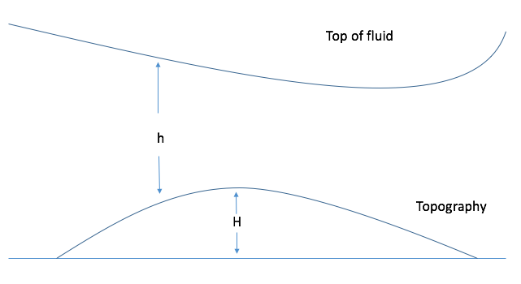

Here we use the common simple shallow water model. I think most atmospheric dynamic books would document these equations:
$$
\dfrac{\partial u}{\partial t} + u\dfrac{\partial u}{\partial x} + v\dfrac{\partial u}{\partial y} = fv - g\dfrac{\partial (h+H)}{\partial x} \\
\dfrac{\partial v}{\partial t} + u\dfrac{\partial v}{\partial x} + v\dfrac{\partial v}{\partial y} = -fu - g\dfrac{\partial (h+H)}{\partial y} \\
\dfrac{\partial h}{\partial t} + \dfrac{\partial hu}{\partial x} + \dfrac{\partial hv}{\partial y} = 0
$$
These equations contains several non-linear term, which is not suitable for numerical method. Thus, we could rewrite above equations into flux-form after some algebra:
$$
\dfrac{\partial hu}{\partial t} + \dfrac{\partial}{\partial x}(hu^2 + \frac{1}{2}gh^2) + \dfrac{\partial}{\partial y}uvh = hfv - gh\dfrac{\partial H}{\partial x} \\
\dfrac{\partial hv}{\partial t} + \dfrac{\partial}{\partial x}uvh + \dfrac{\partial}{\partial y}(hv^2+\frac{1}{2}gh^2) = -hfu - gh\dfrac{\partial H}{\partial y} \\
\dfrac{\partial h}{\partial t} + \dfrac{\partial hu}{\partial x} + \dfrac{\partial hv}{\partial y} = 0
$$
The flux-form shallow water equations could be solved by numerical method.  

This model is not a global model, so we should make some assumption on Coriolis parameter $f$. Here I assume $f=f_0+\beta y$

