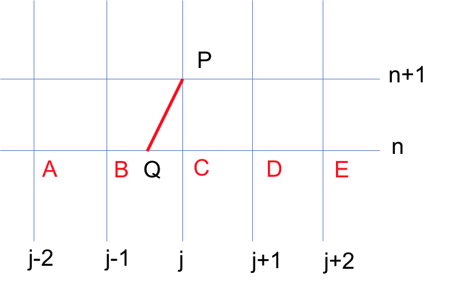

For completion and better understanding, I would show how to construct some famous numerical methods  based on characteristics. We still consider the 1-d convection equation for simplicity and clarity.

Suppose CFL condition holds, and the characteristic pass through P and intercept BC at Q. Thus, we could have $\phi(P)=\phi(Q)$. The value of Q should be determined by interpolation because Q is not a grid. According to the characteristic, we could have: $x_Q=x_{j+1}-c\Delta t$, then each segment could be determined: $|QC|=c\Delta t$, $|QB|=\Delta x-c\Delta t$. Define $\lambda=\dfrac{\Delta t}{\Delta x}$. 

#### Upwind Scheme

If we use B, C to determine $\phi(Q)$ by linear interpolation, we could have:  
$$
\phi(P)=\phi(Q)=(1-c\lambda)\phi(C)+c\lambda\phi(B)
$$
thus we could obtain the **Upwind Scheme**:  
$$
\phi_{j}^{n+1}=\phi_{j}^{n}-c\lambda(\phi_{j}^{n}-\phi_{j}^{n-1})
$$

#### Lax-Friedrichs Scheme

If we use B, D instead of B, C, we could have: 
$$
\phi(P)=\dfrac{1}{2}(1-c\lambda)\phi(D)+\dfrac{1}{2}(1+c\lambda)\phi(B)
$$
and finally we could have the **Lax-Friedrichs Scheme**:  
$$
\phi_{j}^{n+1}=\dfrac{1}{2}(\phi_{j-1}^{n}+\phi_{j+1}^{n})-\dfrac{1}{2}c\lambda(\phi_{j+1}^{n}-\phi_{j-1}^{n})
$$

#### Lax-Wendroff Scheme

If we use B, C and D, we could have: 
$$
\phi(P)=\phi(C)-c\lambda(\phi(C)-\phi(B))-\dfrac{1}{2}c\lambda(1-c\lambda)(\phi(B)−2\phi(C)+\phi(D))
$$
and obtain the famous **Lax-Wendroff Scheme**:  
$$
\phi_j^{n+1}=\phi_j^{n}-\dfrac{1}{2}c\lambda(\phi_{j+1}^{n}-\phi_{j-1}^{n})+\dfrac{1}{2}c^2\lambda^2(\phi_{j+1}^{n}-2\phi_{j}^{n}+\phi_{j-1}^{n})
$$

#### Beam-Warming Scheme

If we use A, B and C, we could have the **Beam-Warming Scheme**:  
$$
\phi_{j}^{n+1}=\phi_{j}^{n}-c\lambda(\phi_{j}^{n}-\phi_{j-1}^{n})-\dfrac{1}{2}c\lambda(1-c\lambda)(\phi_{j}^{n}-2\phi_{j-1}^{n}+\phi_{j-2}^{n})
$$
