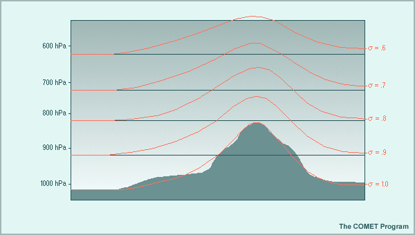
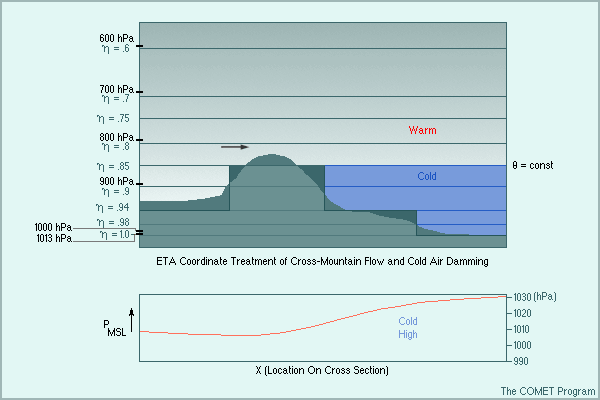
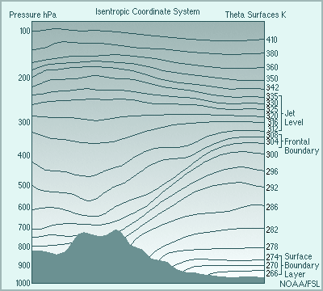
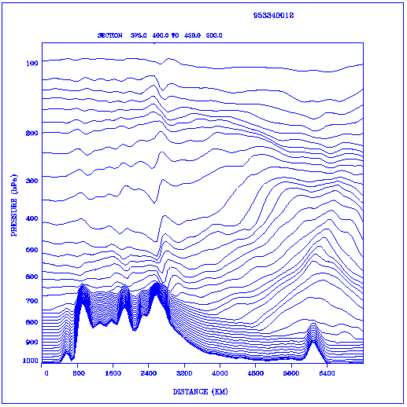

# 数值模式中的垂直坐标

> 这份笔记来自Fuqing Zhang 2002 NWP Model Notes，总结了数值模式中常见的三种垂直坐标系

## Introduction

Properly depicting the vertical structure of the atmosphere leads to better forecasts by Numerical Weather Prediction Models.  To successfully understand this vertical structure, the model must have an appropriate vertical coordinate to lead to better resolution and thus better forecasts.  Numerical Weather Prediction models produce these forecasts by computing the average over these coordinate surfaces, rather than on the surface itself.  At this point, one familiar with forecasting models might ask: "Why not use pressure and height surfaces, as they are used in most maps anyway?"  The reason that these surfaces are not used in Numerical Weather Prediction is because they cause much confusion at the ground.  Therefore, other surfaces have been developed and used in the vertical.  Some of the most popular surfaces used in many of the current models are the Sigma, Eta, and Theta surfaces(UCAR, 2000).  These will be the surfaces we will focus our attention to in this webpage, describing each vertical coordinate system,  giving examples of models from coordinate systems, and making an evaluation of the coordinate types.

## Description of Vertical Coordinate Systems

### Sigma Coordinate

The sigma coordinate system defines the base at the model's ground level. The surfaces in the sigma coordinate system follow the model terrain and are steeply sloped in the regions where terrain itself is steeply sloped. the sigma coordinate system defines the vertical position of a point in the atmosphere as a ratio of the pressure difference between that point and the top of the domain to that of the pressure difference between a fundamental base below the point and the top of the domain. Because it is pressure based and normalized, it is easy to mathematically cast governing equations of the atmosphere into a relatively simple form.

#### Advantges

1. The sigma coordinate system conforms to natural terrain. This allows for good depiction of continous fields, such as temperature advection and winds, in areas where terrain varies widely but smoothly.

2. It lends itself to increasing vertical resolution near the ground. This allows the model to better define boundary-layer processes, such as diurnal heating, low-level winds, turbulence, low-level moisture, and static stability.

3. Eliminates the problem of vertical coordinate systems intersecting the ground, unlike height or isentropic coordinates.

#### Limitations

1. The model wind forecast depend upon accurate calculations of the pressure gradient force (PGF). This is easly calculated in pressure coordinates when the height is known. Yet, when sigma surfaces slope, the PGF must be expanded to include the effects of the slope. This introduces errors because the lapse rate must be approximated at points that lie in between the pressure surfaces where height is observed.

2. Sigma models have a difficult time dealing with weather events on the lee-side of mountain ranges (i.e. cold-air damming, lee-side cyclogenesis).

3. Because of the smoothing required in the mountain ranges along coastlines, land points can be forced to extend beyond the true coastline.

#### Examples of Sigma Models or Varients

##### Aviation/Medium Range Forecast (AVN/MRF) Model

It has a vertical domain that runs from the surface to about 2.0 hPa. For a surface pressure of 1000 hPa, the lowest level is at about 996 hPa.

The vertical domain is represented by a sigma coordinate and a Lorenz grid.

It uses a quadratic conserving finite difference scheme.

The resolution is divided into 42 unequally spaced sigma levels, where for a surface pressure of 1000 hPa, twelve levels are below 800 hPa, twenty levels between 800hpa and 100hpa, and ten are above 100 hPa. (COMET)

As of 9 January, 2001, The GSM had the following settings (GMBOB): Spectral triangular 170 (T170) Horizontal Resolution.

The Gaussian grid of 512x256, roughly equivalent to 0.7x0.7 degree latitude/longitude.

A Vertical Representation in Sigma coordinates on a Lorenz grid with a Quadratic conserving finite difference scheme by Arakawa and Minz (1974).

##### Nested Grid Model (NGM):

The terrain following system simplifies the treatment of processes at the bottom of the model atmosphere.
The same vertical structure of 16 layers is carried throughout the analysis, initialization, and forecast components of the NGM to eliminate inconsistencies that may arise through vertical interpolation.
The thickness of the layers in the NGM change smoothly with height, with greatest resolution near the bottom of the atmosphere, with the bottom layer being 35 millibars thick when the surface pressure is 1000 millibars, and 17.5 millibars thick when the surface pressure is 500 millibars.
The pressure thickness of the layers increase with height to a maximum in layer-10 (near 450 mb) of 75 mb when the surface is 1000 mb.
The high resolution near the surface in the NGM is desirable for capturing the behavior of boundary layer processes in the NGM analysis and forecast(Hoke, James E. ; 325).

##### European Center Medium Range Weather Forecasting Model (ECMWF):

The European Center for Medium-range Weather Forecasting model uses 31 levels between the earth's surface and 30 km.

With a horizontal resolution of 60 km, the model forecasts at 4,154,868ATMO689/Lecture8/ points in the upper air.

With this resolution, it can produce forecasts for near surface weather parameters such as local winds and temperature (Woods 1998).

Example of Sigma Coordinate Model

### ETA Coordinate Model

The fundamental base in the eta system is not at the ground surface, but instead is at mean sea level. The eta coordinate system has surfaces that remain relatively horizontal at all times. At the same time, it retains the mathematical advantages of the pressure based system that does not intersect the ground. It does this by allowing the bottom atmospheric layer to be represented within each grid box as a flat "step". The eta coordinate system defines the vertical position of a point in the atmosphere as a ratio of the pressure difference between that point and the top of the domain to that of the pressure difference between a fundamental base below the point and the top of the domain. The ETA coordinate system varys from one at the base to zero at the top of the domain. Because it is pressure based and normalized, it is easy to mathematically cast governing equations of the atmosphere into a relatively simple form.

#### Advantges

1. Eta models do not need to perform the vertical interpolations that are necessary to calculate the PGF in sigma models (Mesinger and Janji 1985). This reduces the error in PGF calculation and improves the forecast of wind and temperature and moisture changes in areas of steeply sloping terrain.

2. Although the numerical formulation near the surface is more complex, the low-level convergence in areas of steep terrain are far more representative of real atmospheric conditions than in the simpler formulations in sigma models (Black 1994). The improved forecasts of low-level convergence result in better precipitation forecasts in these areas. The improved predictable flow detail compared to a comparable sigma model more than compensates for the slightly increased computer run time.

3. Compared with sigma models, eta models can often improve forecasts of cold air outbreaks, damming events, and leeside cyclogenesis For example, in cold-air damming events, the inversion in the real atmosphere above the cold air mass on the east side of a mountain are preserved almost exactly in an eta model.

#### Limitations

1. The step nature of the eta coordinate makes it difficult to retain detailed vertical structure in the boundary layer over the entire model domain, particularly over elevated terrain.

2. Eta models do not accurately depict gradually sloping terrain. Since all terrain is represented in discrete steps, gradual slopes that extend over large distances can be concentrated within as few as one step. This unrealistic compression of the slope into a small area can be compensated, in part, by increasing the vertical and/or horizontal resolution.

3. Eta models have difficulty predicting extreme downslope wind events.

#### An example of ETA Step Models

##### ETA Model

This model uses 50 vertical levels (NCEP 2000).

The eta coordinate was used in order to remove the large errors which are known to occur when computing the horizontal pressure gradient force, as well as the advection and horizontal diffusion along a steeply sloped coordinate surface, such as the sigma surfaces in the NGM model (Mesinger, 1984).

This coordinate system makes the eta surfaces quasi-horizontal everywhere as opposed to sigma  surfaces which can be steeply sloped(Black, 1994).
This model is often being updated, and changes are made quite frequently on its resolution.

Example of Cold-Air Damming

### Theta Coordinate Model System

#### Advantges

1. Potential vorticity is better conserved, and precipitation spin-up in short-range forecasts is reduced.

2. 3-D advection becomes essentially 2-D in theta coordinates.

3. The theta coordinate allows for more vertical resolution in the vicinity of baroclinic regions like fronts and near the tropopause, this allows more accurate depictions of significant horizontal and vertical wind shears and het streaks.

4. Vertical motion through isentropic surfaces is caused almost exclusively by diabatic heating. Vertical motion isentropic models is a result of two processes: adiabatic motion and diabatic forcing. Adiabatic vertical motions are included within the horizontal component of the isentropic forecast equations. By having the total vertical motion related only to these adiabatic components, there is afar more direct cause and effect relationship in interpreting the mdel forecast fields.

5. Isentropic coordinate models conserve important dynamical quantities such as ptential vorticity.

#### Limitations

1. A MAJOR limitation of the theta coordinate system occurs in the boundary layer, where the flow can be strongly non-adiabatic.

2. Isentropic surfaces intersect the ground so they cannot be located at all times during the day. That's why sigma coordinates are used in the boundary layer. This allows at least five layers of the model to follow surface terrain.

3. Isentropic coordinates may not exhibit monotonic behavior with height in the boundary layer. If superadiabatic layers develop in the boundary layer due to diurnal heating, isentropic surfaces then appear more than once in the vertical, about a point. This can't be allowed in the models vertical coordinate system, and could severely limit the model's ability to predict many weather advents.

4. Vertical resolution in nearby adiabatic layer is coarse. The same quality that leads to enhanced resolutions in baroclinic zones conversely means that large adiabatic regions will have decreased vertical resolutions when theta coordinates are used. This leads to problems in adequately resolving the vertical mixing in these regions.

#### Explenation of Theta System

Since the flow in the free atmosphere is mostly isentropic, potential temperature is useful as a vertical coordinate system. Since non-adiabatic processes domintate in the boundary layer and potential temperature intersects the earth's surface, theta coordinates are not used alone in any of the models. Instead they do work very well as a hydrid system, since they handle motions about the boundary layer very-well.
The RUC-2 model uses a hybrid system. Theta coordinates are used aloft in the RUC-2 model. It provides improved resolution where there are large temperatures gradients. Much of the interesting weather takes place in this area. RUC-2 is used for short-range weather forecasting or "now casting".

### Hybrid Coordinate Models

The hybrid coordinate sytem is a combination of both a theta coordinate system (above the boundary layer) and a sgima coordinate system (below the boundary layer).Theta coordinates are isentropic coordinates that are layered throughout the atmosphere. The theta surfaces are not used near the ground due to the fact that they are not terrain following coordinates. Instead, the sigma coordinates are used near the surface of the earth.

#### Advantges

1. This system retains the advantages of isentropic models in the free atmosphere, including better precipitation starting times for isentropic upglide than in sigma-coordinate models.

2. This system eliminates the problem of isentropic surfaces intersecting the ground.

3. This system represents surface heating and dynamical mixing in the boundary layer well.

4. The system allows good surface physics interactions, including surface evaporation and treatment of snow cover.

#### Limitations

1. Hybrid isentopic-sigma models no longer preserve adiabatic flow in the boundary layer as easily as pure isentropic models.

2. The depth of the sigma layers does not match the true depth of the PBL, so processes near the PBL/free atmosphere interface may not be depicted with the best coordinate.

3. It can be difficult to blend coordinate types at their interfaces.

#### An Example of the Hybride Coordinate System

##### Rapid Update Cycle (RUC-2)

The RUC-2 has 40 vertical levels.

The minimum potential temperature spacing occurs through much of the tropopause and is 2K.

The top level is 450K.

It continues to use a generalized vertical coordinate configured as a hybrid isentropic-sigma coordinate in both the analysis and model.

This coordinate has proven to be very advantageous in providing sharper resolution near fronts and the tropopause.  (e.g., Benjamin 1989, Johnson et al. 1993, Zapotocny et al. 1994).

The prespecified pressure spacing in RUC-2, starting from the ground is 2, 5, 8, and 10 mb, followed by as many 15-mb layers as are needed.

This terrain-following spacing compacts somewhat as the terrain elevation increases.  This provides excellent resolution of the boundary layer in all locations, including over higher terrain.

The RUC-2 has an explicit level actually at the surface; no extrapolation from higher levels is necessary to diagnose values at the surface.

Figure 4: Hybrid Coordinate System (See Description Below)

The above picture is a sample cross section of RUC-2 native levels. This is the same picture used above as an example of a hybrid coordinate system.  The cross-section is across the United States, passing south of San Francisco California, through Boulder Colorado (where a downslope windstorm occurred that morning) and then through southern Virginia to the East Coast. The cross section is for a 12-h forecast valid at 1200 UTC 30 November 1995.

The typical RUC-2 resolution near fronts is apparent in this figure,ATMO689/Lecture8/ as well as the tendency for more terrain-following levels to "pile up" in warmer regions (the eastern part of the cross section, in this case).

## Critical Evaluation of Coordinate Types

### Sigma and Eta Coordinates

1. The sigma and eta coordinates are better for uses near the ground since they are terrain-following coordinates compared to the theta coordinate, which is not.

2. The sigma and eta coordinates have mathematical advantages of casting the governing equations of the atmosphere into a relatively simple form.

3. Both the sigma and eta coordinates also guarantee a certain vertical resolution even when the stratification is weak.

4. All of the adiabatic component of the vertical motion on the isentropic surfaces is captured in flow along the 2-D surfaces. Vertical advection, which usually has somewhat more truncation error than horizontal advection, does much less "work" in isentropic/sigma hybrid models than in quasi-horizontal coordinate models. This characteristic results in improved moisture transport and very little precipitation spin-up problem in the first few hours of the forecast.

5. Both of these coordinate systems tend to be better for long range forecasting for large areas.

### Theta Coordinates

1. Theta coordinates make better use of observations in objective analysis.  The influence of the observations is extended along quasi-material theta surfaces along which advection occurs rather than the quasi-horizontal surfaces used with other vertical coordinates.ATMO689/Lecture8/

2. Improved quality control: Observations tend to appear more homogeneous on isentropic surfaces than the quasi-horizontal surfaces.

3. Vertical truncation error is virtually absent.  3-D advection becomes essentially 2-D in theta coordinates.

4. Potential vorticity is better conserved, and precipitation spin-up in short-range forecasts is reduced.

5. These are better at looking at short range forecasts as they show large amounts of detail (Nielson-Gammon, 2000).

| Vertical Coordinate| Models|Primary Advantage |Primary Limitation|
|--------------------|-------|------------------|--------------------|
|Eta |Eta|Allows for large local differences in terrain from one grid point to another|May not represent the boundary layer with sufficient resolution over elevated terrain|
|Generic hybrid|ECMWF, NOGAPS|Combines strengths of several coordinate systems|Difficult to properly interface across coordinate domains|
|Isentropic-sigma hybrid|RUC|Naturally increases resolution in baroclinic regions, such as fronts and tropopause|Incompletely depicts important low-level adiabatic flow|
|Sigma|AVN/MRF, NGM, MM5, RAMS|Surfaces are terrain-following and therefore resolve the boundary layer well|May not correctly portray weather events in lee of mountains|

The following table summarizes how well each coordinate meets the criteria for serving as a vertical coordinate.

|Criteria|Sigma|Eta|Isentropic|Hybrid Isentropic-Sigma|
|--------|-----|---|----------|-------------------------|
|Exhibits monotonic behavior|Yes|Yes|May not|Yes|
|Preserves conservative atmospheric properties and processes|Fairly well|Fairly well|Very well|Well|
|Accurately portrays pressure gradient force|No|Yes|Mostly|Mostly|

## REFERENCES:

Benjamin, Stanley G., 1998: RUC-2 - The Rapid Update Cycle Version 2 Technical Procedures Bulletin - Draft. NOAA/ERL Forecast Systems Laboratory, Boulder, CO

Black, T.L., 1994: The new NMC mesoscale ETA model: Description and forecast examples. Weather. Forecasting, 9, 265-278.

COMET, 1999. AVN/MRF.  T170/L42 Vertical Resolution.

GMBOB (Global Modeling Branch/Operations Branch), NMC. http://sgi62.wwb.noaa.gov:8080/research/mrf.html. GSM Model status update.

Hoke, James E. et al, 19 Dec. 1988:  The Regional Analysis and Forecast System of the National Meteorological Center.  NMC, NWS, and NOAA.

Kalnay and Kanamitsu, 25 Oct. 1995:  Model Status as of Oct. 25, 1995.  NMC Development Division.

Mesinger, 1984: A blocking technique for representation of mountains in atmospheric models. Riv. Meteor. Aeronaut., 44, 195-202.

Nielson-Gammon, John. Lecture on Numerical Weather Prediction, Feb. 9 2000.

Nielson-Gammon,  John. 1998. The Eta Model: A Tutorial on Numerical Weather Prediction Models.
University Corporation for Atmopsheric Research, 2000 http://www.meted.ucar.edu/nwp/9cu1/ic2/frameset.htm?opentopic(2) Vertical Coordinates.

Staudenmaier, M. Jr., 1996: A description of the MESO ETA model. Western Region [NWS] Technical Attachment NO. 96-06.

Environmetal Modeling Center: Log Of Operational ETA Model Changes September 2000. http://www.emc.ncep.noaa.gov/mmb/research/eta.log.html

Woods, Austin, 1998:  ECMWF-Forecasting by Computer.  http://www.ecmwf.int/research/fc by_computer.html:  European Centre for Medium-Range Weather Forecasts (ECMWF).

Nielson-Gammon, John. Interview on Numerical Weather Prediction, 21 Feb. 2001.