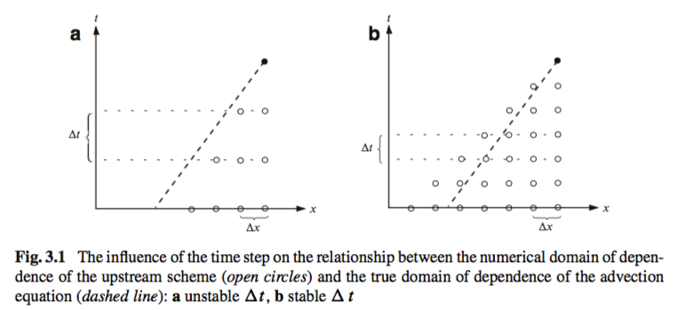
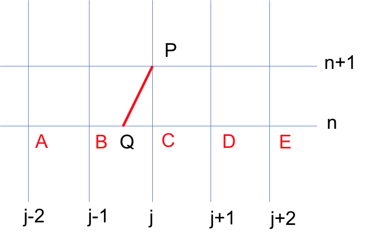
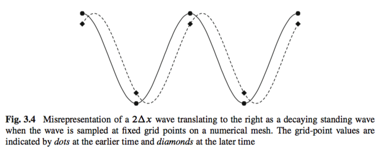
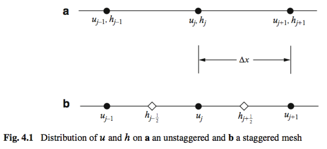
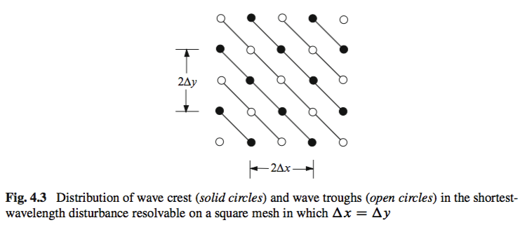

# 流体力学中的计算方法

> I am reading several famous numerical method books *Numerical Methods for Fluid Dynamics: With Application to Geophysics*, *A Climate Modelling Primer* and *Numerical Weather and Climate Prediction*. This note summarizes some basic conception and useful results for me. I also add some personal thinking. This note contains many mathematical formula, please install "Math Anywhere" Plugin if you use Chrome.

## Some basics of partial differential equations (PDE)

- Numerical methods for the solution of time-dependent problems are often disigned to solve systems of PDE in which time derivatives are of first order.

- PDEs containing higher-order time derivatives could be solved by defining new unknown functions equal to the lower-order time derivatives of the original unknown function and expressing the result as a system of partial differential equations in which all time derivatives are of order 1.

- The accurate numerical solution of equations describing wavelike flow becomes more difficult if the solution develops significant perturbations on spatial scales close to the shortest scale that can be resolved by the numerical model. The possibility of waves developing small-scale perturbations from smooth initial data increases as the governing partial differential equations becomes more nonlinear.

- **Characteristics**: To hyperbolic equations, there exits a family of real-valued curves  in the x-t plane along which the solution can be locally determined by integrating ordinary differential equations. These curves are called characteristics. Please see the following example: 
$A(x,t,u)\dfrac{\partial{u}}{\partial{t}}+B(x,t,u)\dfrac{\partial{u}}{\partial{x}}=C(x,t,u)$ is a hyperbolic partial differential equation, which also represents the general first-order quasi-linear equation. If we define $\dfrac{dt}{ds}=A$ and $\dfrac{dx}{ds}=B$, the identity $\dfrac{du}{ds}=\dfrac{\partial{u}}{\partial{t}}\dfrac{dt}{ds}+\dfrac{\partial{u}}{\partial{x}}\dfrac{dx}{ds}$ can be used to re-express the general first-order quasi-linear equation to $\dfrac{du}{ds}=C$.

- Consider a constant coefficient linear system: $\dfrac{\partial{u_r}}{\partial{t}}+\sum_{s=1}^{n}a_{rs}\dfrac{\partial{u_s}}{\partial{x}}=0$, $r=1,2,...n$, this system could be written as $\dfrac{\partial{U}}{\partial{t}}+A\dfrac{\partial{U}}{\partial{x}}=0$. If there exists bounded matrics $T$ and $T^{-1}$ such that $T^{-1}AT=D$, where $D$ is a diagonal matrix with real eigenvalues $d_{jj}$, the system is hyperbolic and could be transformed to $\dfrac{\partial{v}}{\partial{t}}+D\dfrac{\partial{v}}{\partial{x}}=0$ by defining $v=T^{-1}U$. Since $D$ is a diagonal matrix, each element $v_j$ of the vector of unknown functions may be determined by solving a simpler scalar equation of the form $\dfrac{\partial{u}}{\partial{t}}+c\dfrac{\partial{u}}{\partial{x}}=0$. Each diagonal element of $D$ is associated with a family of characteristic curves along which the perturbations in $v_i$ propagate at speed $\dfrac{dx}{dt}=d_{jj}$. The wavelike character of the solution can be demonstrated by Fourier transforming with respect to x to obtain $\dfrac{\partial{\hat{v}}}{\partial{t}}+ikD\hat{v}=0$, where $\hat{v}$ is the Fourier transform of $v$ and $k$ is the wave number, or dual variable. The $j$ th component of $\hat{v}$ must be a wave of the form $e^{ik(x-d_{jj}t)}$. Every solution to the original system is a linear superposition of these waves.

- $\dfrac{\partial{\psi}}{\partial{t}}+\vec{V}\cdot\nabla\psi-S=\nabla\cdot k_{e}\nabla\psi$, where $k_e$ is eddy diffusivity. The eddy diffusivity is supposed to represent the tendency of random unresolved velocity fluctuations to spread the distribution of $\psi$ away from the centerline of the smooth air-parcel trajectories computed from the resolved-scale velocity field.  High values of $k_e$ might, for example, be found in the planetary boundary layer where strong subgrid-scale motions are driven by thermal and mechanical turbulence. Large $k_e$ might also be parameterized to develop in regions where vigorous subgrid-scale motions are generated through Kelvin–Helmholtz instability. In these limited areas of high eddy diffusivity, the solutions to the parameterized problem may no longer be wavelike.

- Unlike sound waves, gravity waves do not even approximately propagate along the characteristics. There is no relation between the characteristics and the paths of the gravity waves because some of the physical processes essential for gravity-wave propagation are mathematically represented by undifferentiated functions of the unknown variables, and as such exert no influence on the shape of the characteristics.

## Ordinary differential equations

- **Trunction Error**: the residual by which smooth solutions to the continuous problem fail to satisfy the discrete approximation.

- **Amplification Factor A**: the ratio of the approximate solution at two adjacent time steps, $A=\phi_{n+1}/\phi_n$. If $|A|=1$, the method is neural; if $|A|>1$, the method is amplifying; if $|A|<1$, the method is damping.

- **Absolutely Stable**: if $|\phi_n|\leqslant|\phi_0|$ for all n, or equivalently, if $|A|\leqslant1$.

- **A-Stability**: if a numerical method is absolutely stable for all $\lambda\Delta t\leqslant0$. Here, $\lambda$ is the real part of $\gamma$, which is the coefficient of equation $\dfrac{d\phi}{dt}=\gamma\phi$, $\phi(0)=\phi_0$.

- **Phase-Speed Errors**: Consider the oscillation equation $\dfrac{d\psi}{dt}=i\omega\psi$, if we integrate it over a time $\Delta t$ yields $\psi(t_0+\Delta t)=e^{i\omega\Delta t}\psi(t_0)\equiv A\psi(t_0)$. If $A$ is expressed in modulus-argument form $|A|e^{i\theta}$, where $|A|=(\Re\lbrace A\rbrace^2+\Im\lbrace A\rbrace^2)^{1/2}$ and $\theta=arctan(\Im\lbrace A\rbrace/\Re\lbrace A\rbrace)$, phase errors may be characterized by the relative phase change, $R=\theta/\omega\Delta t$, which is the ratio of the phase advance produced by one time step of the numerical scheme divided by the change in phase experienced by the true solution over the same time interval. If $R>1$, the method is accelerating; if $R<1$, the method is decelerating. Phase errors accumulate over the period of integration and can be quite large over long time period.

- **L-Stability**: the method is not only A-stable, but also satisfy the additional property that $A \to 0$ as $\Re\lbrace \gamma \rbrace \Delta t \to -\infty$. Here, $\gamma$ is the coefficient of equation $\dfrac{d\phi}{dt}=\gamma\phi$, $\phi(0)=\phi_0$.

- **Stiff**: The time step required to maintain stability in a numerical integration is sometimes far smaller than that which might seem to be sufficient to accurately resolve the evolving variables. In such cases the problem is stiff.

- For Runge-Kutta method, once the time step exceeds the maximum stable time step for the third-order scheme, the fourth-order method becomes highly damping. In some circumstances it may be desirable to selectively damp the highest-frequency modes, and in such cases the fourth-order Runge–Kutta method would be clearly preferable to the first-order Matsuno method. On the other hand, if one wishes to avoid excessive damping of the high-frequency components, it will not be possible to use the full stable time step of the fourth-order Runge–Kutta scheme.

- No explicit Runge-Kutta scheme is A-stable.

- The leapfrog scheme is non-amplifying (unlike the Adams–Bashforth and two-stage Runge–Kutta methods), and it requires only one function evaluation per time step (unlike two-or-higher- stage Runge–Kutta schemes). The weakness of the leapfrog scheme is its undamped computational mode, which slowly amplifies to produce “time-splitting” instability in simulations of nonlinear systems.

- One way to control the growth of the computational mode is to periodically discard the data from the $n-1$ time level (or alternatively to average the $n$ and $n-1$ time-level solutions) and to restart the integration using a two-time-level method.

- Two-stage second-order Runge–Kutta and two-step Adams–Bashforth schemes produce amplifying solutions to the oscillation equation.

- Three-step Adams–Bashforth method is stable and, unlike the second-order leapfrog scheme, has a strongly damped computational mode. The classical three-stage third-order and the four-stage fourth-order explicit Runge–Kutta schemes, as well as the four-stage explicit third-order Strong-stability-perserving Runge–Kutta scheme, are also potentially attractive methods.

- The general form of s-step method could be expressed as $\sum_{k=0}^{s}\alpha_k\phi_{n+k}=\Delta t\sum_{k=0}^{s}\beta_kF(\phi_{n+k},t_{n+k})$. Stability conditions for linear multistep methods can be concisely expressed in terms of the polynomials: $\rho(z)=\sum_{k=0}^{s}\alpha_k z^k$ and $\sigma(z)=\sum_{k=0}^{s}\beta_k z^k$. The linear multistep method is stable enough to converge to the correct solution as $\Delta t \to 0$, provided that it is at least first-order accurate, that the starting values $\phi_1...\phi_s$ converge as $\Delta t \to 0$, and that the polynomial $\rho(z)$ satisfies the root condition. A polynomial satisfies the root condition if the magnitude of each of its roots is bounded by unity and if all the roots of unit magnitude are distinct.

- **Dahlquist's first barrier**: When the choice of coefficients is additionally constrained to require $\rho(z)$ to satisfy the root condition, the highest order than can be achieved by an explicit $s$-step method is $s$; for an implicit $s$-step method it is $s+1$ when $s$ is odd and $s+2$ when $s$ is even. These limitations on the maximum order of stable linear multistep methods constitute Dahlquist's first barrier.

- **Dahlquist's second barrier**: no linear multistep method of order greater than 2 is A-stable.

Summary of methods for the solution of ordinary differential equations: $\dfrac{d\phi}{dt}=F(\phi,t)$, $\phi(0)=\phi_0$. The second- and third-order Runge–Kutta methods are low-storage variants; $h=\Delta t$

|Method|order|Formulae|
|------|-----|---------|
|Forward|1|$\phi_{n+1}=\phi_n+hF(\phi_n)$|
|Backward|1|$\phi_{n+1}=\phi_n+hF(\phi_{n+1})$|
|Asselin leapfrog|1|$\phi_{n+1}=\overline{\phi_{n-1}}+2hF(\phi_n)$, $\overline{\phi_n}=\phi_n+\gamma(\overline{\phi_{n-1}}-2\phi_n+\phi_{n+1})$|
|Leapfrog|2|$\phi_{n+1}=\phi_{n-1}+2hF(\phi_n)$|
|Adams-Bashforth|2|$\phi_{n+1}=\phi_{n}+\dfrac{h}{2}[3F(\phi_n)-F(\phi_{n-1})]$|
|Trapezoidal|2|$\phi_{n+1}=\phi_{n}+\dfrac{h}{2}[F(\phi_{n+1})+F(\phi_{n})]$|
|Runge-Kutta 2-step explicit|2|$q_1=hF(\phi_n)$, $\phi_1=\phi_n+q_1$   $q_2=hF(\phi_1)-q_1$, $\phi_{n+1}=\phi_1+q_2/2$|
|Magazenkov|2|$\phi_{n}=\phi_{n-2}+2hF(\phi_{n-1})$   $\phi_{n+1}=\phi_{n}+\dfrac{h}{2}[3F(\phi_{n})-F(\phi_{n-1})]$|
|Leapfrog-trapezoidal|2|$\phi_{1}=\phi_{n-1}+2hF(\phi_{n})$,   $\phi_{n+1}=\phi_{n}+\dfrac{h}{2}[F(\phi_{1})+F(\phi_{n})]$|
|Adams-Bashforth|3|$\phi_{n+1}=\phi_{n}+\dfrac{h}{12}[23F(\phi_{n})-16F(\phi_{n-1})+5F(\phi_{n-2})]$|
|Adams-Moulton|3|$\phi_{n+1}=\phi_{n}+\dfrac{h}{12}[5F(\phi_{n+1})+8F(\phi_{n})-F(\phi_{n-1})]$|
|Adams-Bashforth-Moulton predictor corrector|3|$\phi_{1}=\phi_{n}+\dfrac{h}{2}[3F(\phi_{n})-F(\phi_{n-1})]$,   $\phi_{n+1}=\phi_{n}+\dfrac{h}{12}[5F(\phi_{1})+8F(\phi_{n})-F(\phi_{n-1})]$|
|Runge-Kutta 3-step explicit|3|$q_1=hF(\phi_n)$, $\phi_1=\phi_n+q_1/3$,   $q_2=hF(\phi_1)-5q_1/9$, $\phi_2=\phi_1+15q_2/16$,   $q_3=hF(\phi_2)-153q_2/128$, $\phi_{n+1}=\phi_2+8q_3/15$|
|Runge-Kutta 4-step explicit|4|$q_1=hF(\phi_n)$, $q_2=hF(\phi_n+q_1/2)$,   $q_3=hF(\phi_n+q_2/2)$, $q_4=hF(\phi_n+q_3)$,   $\phi_{n+1}=\phi_n+(q_1+2q_2+2q_3+q_4)/6$|

Characteristics of the schemes listed in the above table. The amplification factor and relative phase change are for well-resolved solutions to the oscillation equation, and $s=\omega \Delta t$. Max $s$ is the maximum value of $\omega\Delta t$ for which the solution is non-amplifying. The column labeled “storage factor” indicates the number of full arrays that must be allocated for each unknown variable in order to implement each
scheme. No storage factor is given for implicit schemes because the storage factor for implicit methods can vary from problem to problem, depending on the numerical algorithm used to solve the implicit system. A rough measure of the comparative efficiency of each method may be obtained by defining an efficiency factor as the maximum stable time step with which the oscillation equation can be integrated divided by the number of evaluations of $F(\phi)$ that each scheme requires to perform a single integration step.

|Method|Storage factor|Efficiency factor|Amplification factor|Phase error|Max $s$|
|------|-----|---------|----------------|--------------------------------|-----------|--------|
|Forward|2|0|$1+\dfrac{s^2}{2}$|$1-\dfrac{s^2}{3}$|0|
|Backward|-|$\infty$|$1-\dfrac{s^2}{2}$|$1-\dfrac{s^2}{3}$|$\infty$|
|Asselin leapfrog|3|<1|$1-\dfrac{\gamma s^2}{2(1-\gamma)}$|$1+\dfrac{(1+2\gamma)s^2}{6(1-\gamma)}$|<1|
|Leapfrog|2|1|1|$1+\dfrac{s^2}{6}$|1|
|Adams-Bashforth-2|3|0|$1+\dfrac{s^4}{4}$|$1+\dfrac{5}{12}s^2$|0|
|Trapezoidal|-|$\infty$|1|$1-\dfrac{s^2}{12}$|$\infty$|
|Runge-Kutta-2|2|0|$1+\dfrac{s^4}{8}$|$1+\dfrac{s^2}{6}$|0|
|Magazenkov|3|0.67|$1-\dfrac{s^4}{4}$|$1+\dfrac{s^2}{6}$|0.67|
|Leapfrog-trapezoidal|3|0.71|$1-\dfrac{s^4}{4}$|$1-\dfrac{s^2}{12}$|1.41|
|Adams-Bashforth-3|4|0.72|$1-\dfrac{3}{8}s^4$|$1+\dfrac{289}{720}s^4$|0.72|
|Adams-Moulton|-|0|$1+\dfrac{s^4}{24}$|$1-\dfrac{11}{720}s^4$|0|
|Adams-Bashforth-Moulton predictor corrector|4|0.60|$1-\dfrac{19}{144}s^4$|$1+\dfrac{1243}{8640}s^4$|1.20|
|Runge-Kutta-3|2|0.58|$1-\dfrac{s^4}{24}$|$1+\dfrac{s^4}{30}$|1.73|
|Runge-Kutta-4|4|0.70|$1-\dfrac{s^6}{144}$|$1-\dfrac{s^4}{120}$|2.82|

## Finite-difference approximations for one-dimensional transport

- **Lax equivalence theorem**: if a finite-difference scheme is linear, stable, and accurate of order $(p; q)$, then it is convergent of order $(p; q)$.

- **Stability analysis method**: The Energy Method; Von Neumann's Method; The Courant-Friedrichs-Lewy Condition.

- **The Energy Method**:  the energy method is important because, unlike the von Neumann method, it can be applied to nonlinear equations and to problems without periodic boundaries. The basic idea behind the energy method is to find a positive-definite quantity like $\sum_{j}(\phi_j^n)^2$ show that this quantity is bounded for all n. If $\sum_{j}(\phi_j^n)^2$ is bounded, the solution is stable with respect to the $L_2$ norm.

- **Von Neumann's Method**: One drawback of the energy method is that each new problem requires fresh insight to define an appropriate energy and to show that the finite-difference scheme preserves a bound on that energy. Von Neumann's method has the advantage that it can be applied by following a prescribed procedure; however, it is applicable only to linear finite-difference equations with constant coefficients. The basic idea of the von Neumann method is to represent the discretized solution at some particular time step by a finite Fourier series of the form $\phi_n^j=\sum_{k=-N}^{N}a_k^ne^{ikj\Delta x}$, and to examine the stability of the individual Fourier components. The total solution will be stable if and only if every Fourier component is stable. The use of finite Fourier series is strictly appropriate only if the spatial domain is periodic. When problems are posed with more general boundary conditions, a rigorous stability analysis is more difficult, but the von Neumann method still provides a useful way of weeding out obviously unsuitable schemes.

- **The Courant-Friedrichs-Lewy Condition**: The basic idea of the Courant–Friedrichs–Lewy (CFL) condition is that the solution of a finite-difference equation must not be independent of the data that determine the solution to the associated partial differential equation. The CFL condition can be made more precise by defining the domain of influence of a point $(x_0,t_0)$ as that region of the $x–t$ plane where the solution to some particular partial differential equation is influenced by the solution at $(x_0,t_0)$. The CFL condition requires that the numerical domain of dependence of a finite-difference scheme include the domain of dependence of the associated partial differential equation. Satisfaction of the CFL condition is a necessary condition for stability, but is not sufficient to guarantee stability. 

-  When solutions become unstable, they usually become contaminated by large-amplitude short waves.

- **Lax-Wendroff scheme**: Consider such a simple advection equation $\dfrac{\partial{\phi}}{\partial{t}}+c\dfrac{\partial{\phi}}{\partial{x}}=0$. This equation satisfies: $\dfrac{\partial{\phi}}{\partial{t}}=-c\dfrac{\partial{\phi}}{\partial{x}}$ and $\dfrac{\partial^2{\phi}}{\partial{t^2}}=c^2\dfrac{\partial^2{\phi}}{\partial{x^2}}$. Suppose $\phi(x,t)$ is the smooth solution of the advection equation and expand $\phi(x_j,t_{n+1})$ at point $(x_j,t_n)$, we could obtain $\phi(x_j,t_{n+1})=\phi(x_j,t_n)+\Delta t (\dfrac{\partial{\phi}}{\partial{t}})_j^n+\dfrac{\Delta t^2}{2}(\dfrac{\partial^2{\phi}}{\partial{t^2}})_j^n+O(\Delta t^3)$. Then we could have: $\phi(x_j,t_{n+1})=\phi(x_j,t_n)-c\Delta t(\dfrac{\partial{\phi}}{\partial{x}})_j^n+\dfrac{c^2\Delta t^2}{2}(\dfrac{\partial^2{\phi}}{\partial{x^2}})_j^n+O(\Delta t^3)$. The derivatives in above formula could be substituted using central differential scheme: $(\dfrac{\partial{\phi}}{\partial{x}})_j^n=\dfrac{1}{2\Delta x}(\phi(x_{j+1},t_n)-\phi(x_{j-1},t_n))+O(\Delta x^2)$ and $(\dfrac{\partial^2{\phi}}{\partial{x^2}})_j^n=\dfrac{1}{\Delta x^2}(\phi(x_{j+1},t_n)-2\phi(x_{j},t_n)+\phi(x_{j-1},t_n))+O(\Delta x^2)$. Then we could have: $\phi(x_j,t_{n+1})=\phi(x_j,t_n)-\dfrac{c}{2}\dfrac{\Delta t}{\Delta x}(\phi(x_{j+1},t_n)-\phi(x_{j-1},t_n))+O(\Delta t \Delta x^2)$   $+\dfrac{c^2}{2}\dfrac{\Delta t^2}{\Delta x^2}(\phi(x_{j+1},t_n)-2\phi(x_{j},t_n)+\phi(x_{j-1},t_n))+O(\Delta t^2 \Delta x^2)+O(\Delta t^3)$.   Neglecting the high-order term, we could have the Lax-Wendroff scheme:   $\phi_j^{n+1}=\phi_j^{n}-\dfrac{c\Delta t}{2\Delta x}(\phi_{j+1}^{n}-\phi_{j-1}^{n})+\dfrac{c^2\Delta t^2}{2\Delta x^2}(\phi_{j+1}^{n}-2\phi_{j}^{n}+\phi_{j-1}^{n})$.   The trunction error is $O(\Delta t^2+\Delta x^2)$.   The Lax-Wendroff scheme also could be expressed as a two-step formula in which each individual step is centered in space and time. The first step:   $\dfrac{\phi_{j+\frac{1}{2}}^{n+\frac{1}{2}}-\dfrac{1}{2}(\phi_{j+1}^n+\phi_j^n)}{\dfrac{1}{2}\Delta t}=-c(\dfrac{\phi_{j+1}^n-\phi_{j}^n}{\Delta x})$   $\dfrac{\phi_{j-\frac{1}{2}}^{n+\frac{1}{2}}-\dfrac{1}{2}(\phi_{j}^n+\phi_{j-1}^n)}{\dfrac{1}{2}\Delta t}=-c(\dfrac{\phi_{j}^n-\phi_{j-1}^n}{\Delta x})$   In the second step, $\phi_j^{n+1}$ is computed from:   $\dfrac{\phi_{j}^{n+1}-\phi_{j}^{n}}{\Delta t}=-c(\dfrac{\phi_{j+\frac{1}{2}}^{n+\frac{1}{2}}-\phi_{j-\frac{1}{2}}^{n+\frac{1}{2}}}{\Delta x})$. The Lax-Wendroff scheme could be recovered by eliminating $\phi^{n+1/2}$ and $\phi^{n-1/2}$ in the second step formula using first step formula. Also, if the wind speed $c$ is a function of the spatial coordinate , $c$ is replaced by $c_{j+1/2}$, $c_{j-1/2}$ and $c_j$ in first and second step formula respectively.

- **Constructing scheme based on characteristics**:   For clarity, we use the following diagram to show how to construct scheme using characteristic.  
  Suppose CFL condition holds, and the characteristic pass through P and intercept BC at Q. Thus, we could have $\phi(P)=\phi(Q)$. The value of Q should be determined by interpolation because Q is not a grid. According to the characteristic, we could have: $x_Q=x_j-c\Delta t$, then each segment could be determined: $|QC|=c\Delta t$, $|QB|=\Delta x-c\Delta t$. Define $\lambda=\dfrac{\Delta t}{\Delta x}$.   **1)** if we use B, C to determine $\phi(Q)$ by linear interpolation, we could have:   $\phi(P)=\phi(Q)=(1-c\lambda)\phi(C)+c\lambda\phi(B)$   thus we could obtain the **Upwind Scheme**:   $\phi_{j}^{n+1}=\phi_{j}^{n}-c\lambda(\phi_{j}^{n}-\phi_{j}^{n-1})$;   **2)** if we use B, D instead of B, C, we could have:   $\phi(P)=\dfrac{1}{2}(1-c\lambda)\phi(D)+\dfrac{1}{2}(1+c\lambda)\phi(B)$   and finally we could have the **Lax-Friedrichs Scheme**:   $\phi_{j}^{n+1}=\dfrac{1}{2}(\phi_{j-1}^{n}+\phi_{j+1}^{n})-\dfrac{1}{2}c\lambda(\phi_{j+1}^{n}-\phi_{j-1}^{n})$.   **3)** if we use B, C and D, we could have:   $\phi(P)=\phi(C)-c\lambda(\phi(C)-\phi(B))-\dfrac{1}{2}c\lambda(1-c\lambda)(\phi(B)−2\phi(C)+\phi(D))$   and obtain the famous **Lax-Wendroff Scheme**:   $\phi_j^{n+1}=\phi_j^{n}-\dfrac{1}{2}c\lambda(\phi_{j+1}^{n}-\phi_{j-1}^{n})+\dfrac{1}{2}c^2\lambda^2(\phi_{j+1}^{n}-2\phi_{j}^{n}+\phi_{j-1}^{n})$   **4)** if we use A, B and C, we could have the **Beam-Warming Scheme**:   $\phi_{j}^{n+1}=\phi_{j}^{n}-c\lambda(\phi_{j}^{n}-\phi_{j-1}^{n})-\dfrac{1}{2}c\lambda(1-c\lambda)(\phi_{j}^{n}-2\phi_{j-1}^{n}+\phi_{j-2}^{n})$

- Methods to analyze numerical dissipation and dispersion: discrete-dispersion relation; modified equation.

- **Discrete-dispersion relation**: this relation is obtained by substituting a traveling wave solution of the form $\phi_j^n=e^{i(kj\Delta x-\omega n\Delta t)}$ into the finite-difference formula and solving for $\omega$. If the frequency is separated into its real and imaginary parts $(\omega_r+i\omega_i)$, and the wave solution becomes $\phi_j^n=e^{\omega_{i}n\Delta t}e^{i(kj\Delta x-\omega_{r}n\Delta t)}=|A|^ne^{i(kj\Delta x-\omega_{r}n\Delta t)}$. The determination of the imaginary part of $\omega$ is tantamount to a von Neumann stability analysis, since $\omega_i$ determines the amplification factor and governs the rate of numerical dissipation. Information about the phase-speed error can be obtained from $\omega_r$.

- **The modified equation**: The basic logic behind modified equation is the following: 1) we need to solve PDE A1; 2) using numerical scheme B to solve A1, obviously B is an approximation of A1; 3) in fact, numerical scheme B could not only used to solve A1, but also could used to solve A2; 4) suppose B is better in approximating A2 than A1; 5) if we make some properties of A2 clear, then part of properties of A1 is also clear when we use numerical method B. From these analysis, we could notice that the modified equation is used to investigate the property of numerical methods. Now, we take Lax-Friedrichs scheme as an example: $\dfrac{\phi_{j}^{n+1}-\frac{1}{2}(\phi_{j+1}^{n}+\phi_{j-1}^{n})}{\Delta t}+c\dfrac{\phi_{j+1}^{n}-\phi_{j-1}^{n}}{\Delta x}=0$.   First, let's consider its trunction error:   $R_j^n=\dfrac{\phi(x_{j},t_{n+1})-\frac{1}{2}(\phi(x_{j+1},t_{n})+\phi(x_{j-1},t_{n}))}{\Delta t}+c\dfrac{\phi(x_{j+1},t_{n})-\phi(x_{j-1},t_{n})}{\Delta x}$   $=\partial_t\phi+\dfrac{1}{2}\Delta t\partial_{tt}\phi-\dfrac{\Delta x^2}{2\Delta t}\partial_{xx}\phi+O(\Delta t^2+\dfrac{\Delta x^4}{\Delta t})+c\partial_x\phi+O(\Delta x^2)$   $=(\partial_t\phi+c\partial_x\phi)+\dfrac{1}{2}(\Delta t\partial_{tt}\phi-\dfrac{\Delta x^2}{\Delta t}\partial_{tt}\phi)+O(\Delta t^2+\Delta x^2)$   If we assume $\lambda=\Delta t/\Delta x$ is fixed, $\Delta x^4/\Delta t$ could be ignored. If we use Lax-Friedrichs scheme to approximate $\partial_t\phi+c\partial_x\phi+\dfrac{1}{2}\Delta t(\partial_{tt}\phi-\dfrac{1}{\lambda^2}\partial_{xx}\phi)=0$, the scheme could obtain second-order accuracy. While if we use the scheme to approximate $\dfrac{\partial\phi}{\partial t}+c\dfrac{\partial\phi}{\partial x}=0$, the scheme could only obtain first-order accuracy. $\partial_t\phi+c\partial_x\phi+\dfrac{1}{2}\Delta t(\partial_{tt}\phi-\dfrac{1}{\lambda^2}\partial_{xx}\phi)=0$ is called the modified equation of Lax-Friedrichs scheme. Well, this modified equation has second-order derivative of time, it is not easy to study this equation. If we take spatial and time derivative of modified equation, we could have:   $\partial_{xt}\phi=-c\partial_{xx}\phi+O(\Delta t)$   $\partial_{tt}\phi=-c\partial_{tx}\phi+O(\Delta t)=c^2\partial_{xx}\phi+O(\Delta t)$.   Thus, we could obtain another form of the equation:   $\partial_t\phi+c\partial_x\phi=\dfrac{\Delta t}{2\lambda^2}(1-\lambda^2c^2)\partial_{xx}\phi$.   This form of modified equation is in fact the convection diffusion equation, the right hand side of equation is the diffusion term which make the solution smooth even the initial condition is discontinue.   Similarly, we could have the modified equation of other schemes:   **Upwind scheme**: $\partial_t\phi+c\partial_x\phi=\dfrac{c\Delta t}{2\lambda}(1-c\lambda)\partial_{xx}\phi$. This equation reveals that upwind scheme is less diffusive than Lax-Friedrichs scheme and the calculation would be more accurate.   **Lax-Wendroff and Beam-Warming**: these two schemes have a similar form of modified equation:   $\partial_t\phi+c\partial_x\phi=\mu\partial_{xxx}\phi$, $\mu_{LW}=\dfrac{c\Delta x^2}{6}(c^2\lambda^2-1)$, $\mu_{BW}=\dfrac{c\Delta x^2}{6}(2-3c\lambda+c^2\lambda^2)$. This equation is called dispersion equation.

- The speed of numerical wave of LW is smaller than the true value but the BM is the opposite.

- The grid-point representation of a translating $2\Delta x$ wave will be misinterpreted as a decaying standing wave. 

## Beyond one-dimensional transport

- System of equations: Taking linearized one-dimensional shallow-water system as an example, we use von Neumann's method to analyze its stability.   $\dfrac{\partial u}{\partial t}+U\dfrac{\partial u}{\partial x}+g\dfrac{\partial h}{\partial x}=0$   $\dfrac{\partial h}{\partial t}+U\dfrac{\partial h}{\partial x}+H\dfrac{\partial u}{\partial x}=0$.   The $k$ th Fourier component of the solution is represented by the vector $v_k$ and the amplification factor becomes an amplification matrix $A_k$.   $v_k=(u_k,h_k)e^{ikx}$   **1)** If the true solution does not grow with time, an appropriate stability condition is that $||v_k^n||=||A_k^nv_k^0||\le||v_k^0||$ for all $n$ and all wave number $k$ resolved on the numerical mesh.   **2)** If the true solution grows with time, or if one is interested only in establishing sufficient conditions for the convergence of a consistent finite-difference scheme, the preceding condition should be related to $||v_k^n||=||A_k^nv_k^0||\le C_T||v_k^0||$, for all $n\Delta t\le T$ and all sufficiently small values of $\Delta t$ and $\Delta x$. Here $C_T$ may depend on T, the time period over which the equations are integrated, but not on $\Delta t$ and $\Delta x$.   Necessary and sufficient conditions for the stability of a constant-coefficient lin- ear system may be expressed using this norm notation as $||A_k^n||\le 1$ for non-growing solutions and as $||A_k^n||\le C_T$ in cases where the true solution grows with time or where the interest is only in ensuring that the numerical solution will be sufficiently stable to converge in the limit of $\Delta x, \Delta t \to 0$ (Once again, $C_T$ depends on time, but not on $\Delta x$ and $\Delta t$).   The precise necessary and sufficient conditions for an arbitrary matrix to be power-bounded are given by the Kreiss matrix theorem and are relatively complicated. Necessary conditions for the boundedness of $||A_k^n||$ can, however, be expressed quite simply. To have $||A_k^n||\le 1$, i.e., to have a non-growing numerical solution, it is necessary that $\rho_m(A_k)\le 1$. To satisfy the bound on the amplification matrix for growing solutions, it is necessary that $\rho_m(A_k)\le 1+\eta\Delta t$, where $\eta$ is a constant independent of $\Delta x$ and $\Delta t$. The fact that the condition $\rho_m(A_k)\le 1$ is capable of eliminating all highly unstable cases with geometrically growing solutions. Here, $\rho_m$ is the spectral radius, defined as the maximum in absolute value of the eigenvalues of a square matrix.

- **Staggered meshes**: Significant improvements in the accuracy of the short-wavelength components of the solution can sometimes be obtained by the use of staggered meshes. 

- The stability condition for two-dimensional flow is more restrictive than that for the one-dimensional case because shorter-wavelength disturbances are present on the two-dimensional mesh. The manner in which two-dimensional grids can support wavelengths shorter than $2\Delta x$ is illustrated in Fig.4.3. In the case shown in Fig.4.3, $\Delta x=\Delta y=\Delta s$. Grid points beneath a wave crest are indicated by solid circles;
those beneath a trough are indicated by open circles. The apparent wavelength parallel to both the x-axis and the y-axis is $2\Delta s$; however, the true wavelength measured along the line $x=y$ is $\sqrt{2}\Delta s$. As discussed in connection with Fig.4.3, shorter waves are resolvable on a two-dimensional grid, and if properly represented by the spatial differencing, they should generate higher-frequency oscillations and reduce the maximum stable time step. 

- **Split scheme**: Consider such an equation $\partial_t\phi+(L_1+L_2)\phi=0$, where $L_i$ is operator, and we have already known the value of $\phi^n(x)$ and want to obtain $\phi^{n+1}(x)$. The simplest split scheme is: using $\phi^n(x)$ as initial value, integrate equation $\partial_t\phi+L_1\phi=0$ with $\Delta t$ and obtain $\phi^{*}(x)$; then using $\phi^{*}(x)$ as initial value, integrate equation $\partial_t\phi+L_2\phi=0$ with $\Delta t$ to obtain $\phi^{n+1}(x)$. Generally, the continued solution is $\phi^{n+1}(x)=e^{(L_1+L_2)\Delta t}\phi^{n}(x)$ and the numerical solution is $\phi^{n+1}(x)=e^{L_2\Delta t}\phi^{*}(x)=e^{L_2\Delta t}e^{L_1\Delta t}\phi^{n}(x)$. The truncation error of split scheme is:   $e^{(L_1+L_2)\Delta t}-e^{L_2\Delta t}e^{L_1\Delta t}$   $=(1+(L_1+L_2)\Delta t+\frac{1}{2}(L_1+L_2)^2\Delta t^2)+O(\Delta t^3)$   $-(1+L_2\Delta t+\frac{1}{2}L_2^2\Delta t^2)(1+L_1\Delta t+\frac{1}{2}L_1^2\Delta t^2)+O(\Delta t^3)$   $=1+(L_1+L_2)\Delta t+\frac{1}{2}(L_1^2+L_2^2+L_2L_1+L_1L_2)\Delta t^2$   $-(1+L_1\Delta t+\frac{1}{2}L_1^2\Delta t^2+L_2\Delta t+L_2L_1\Delta t^2+\frac{1}{2}L_2^2\Delta t^2)+O(\Delta t^3)$   $=\frac{1}{2}(L_1L_2-L_2L_1)\Delta t^2+O(\Delta t^3)$.   Thus, the overall truncation error in time is $O(\Delta t)$.   For accuracy, Strang also designed the second-order split method: $\partial_t\phi+L_1\phi=0$ is integrated $\Delta t/2$ to obtain $\phi^{*}(x)$ and use $\phi^{*}(x)$ as initial value to integrate $\partial_t\phi+L_2\phi=0$ with $\Delta t$ and obtain $\phi^{**}(x)$; finally, using $\phi^{**}(x)$ as initial value then integrate $\partial_t\phi+L_1\phi=0$ with $\Delta t/2$ to obtain $\phi^{n+1}(x)$. The time truncation error is $O(\Delta t^2)$.

- **Analysis of non-linear stability**: First, the nonlinear equations are linearized; then a frozen-coefficient analysis is performed to determine stability conditions for the linearized problem. This approach gives necessary conditions for stability, but as was the case with variable-coefficient linear equations, it may give misleading results in situations where the solution is dominated by poorly resolved short-wavelength perturbations. Unfortunately, the caveat that the solution must remain smooth and well resolved is a much more serious impediment to the analysis of nonlinear finite-difference equations because such equations can rapidly generate unresolvable short-wave perturbations from very smooth initial data. Rigorous demonstrations of nonlinear stability typically rely on the energy method.

- Domain energy conservation is equivalent to the conservation of $||\phi||_2$; while the enstrophy conservation prevents a systematic cascade of energy into the shortest waves resolvable on the discrete mesh.

## Conservation laws and finite-volume methods

- **Conservation laws and weak solutions**: Many of the partial differential equations arising in fluid dynamics can be expressed as a system of conservation laws of the form $\dfrac{\partial\phi}{\partial t}+\sum_{j}\dfrac{\partial}{\partial x_j}f_j(\phi)=0$, which states that the rate of change of $\phi$ at each point is determined by the convergence of the fluxes $f_j(\phi)$ at that point. Consider solutions to the scalar conservation law $\dfrac{\partial\psi}{\partial t}+\dfrac{\partial}{\partial x}f(x)=0$ on the unbounded domain $-\infty < x < \infty$. Integrating this conservation law over the intervals $[x_1,x_2]$ and $[t_1,t_2]$, one obtains $\int_{x_1}^{x_2}\psi(x,t_2)dx=\int_{x_1}^{x_2}\psi(x,t_1)dx+\int_{t_1}^{t_2}f(\psi(x_1,t))dt-\int_{t_1}^{t_2}f(\psi(x_2,t))dt$, which states that the total change in $\psi$ over the region $x_1 < x < x_2$ is determined by the time-integrated fluxes through the boundary of that region. If satisfies the integral equation on every subdomain $[x_1,x_2]\times[t_1,t_2]$ then $\psi$ is a weak solution of the conservation law. Differentiable weak solutions are also solutions to the partial differential equation and are uniquely determined by the initial data. Non-differentiable weak solutions may, however, be non-unique.

- Non-differentiable weak solutions need not be uniquely determined by the initial data, and if more than one weak solution exists, it is necessary to select the physically relevant solution. When the solutions to equations representing real physical systems develop discontinuities, one of the physical assumptions used to derive those equations is often violated.

-  Thus, one strategy for selecting the physically significant weak solution would be to conduct a series of viscous simulations with progressively smaller viscosities and choose the weak solution toward which the viscous solutions converge. This, of course, is a highly inefficient strategy, and it may be impossible to implement in actual simulations of high-Reynolds-number flow, where any realistic value for the molecular viscosity may be too low to significantly influence the solution on the spatial scales resolvable on the numerical grid. In addition, any attempt to include realistic viscosities in the numerical solution reintroduces precisely those mathematical complications that were eliminated when the full physical system was originally approximated by the simpler inviscid model.

-  One criterion for determining the entropy-consistent solution is to demand that all characteristic curves intersecting the shock be directed in toward the trajectory of the shock.

- There are two special difficulties that can arise in attempting to compute discontinuous solutions to partial differential equations. First, as suggested by the spurious solution generated by the advective-form upstream finite-difference approximation, the numerical scheme might converge to a function that is not a weak solution of the conservation law. Second, the numerical method may converge to a genuine weak solution, but it may fail to converge to the physically relevant entropy- consistent solution.

-  In the finite-volume approach, $\phi_j$ approximates the spatial average of $\psi$ over grid cell $j$,   $\phi_j^n \simeq \dfrac{1}{\Delta x}\int_{x_j-\Delta x/2}^{x_j+\Delta x/2}\psi(x,t^n)dx$   and $F_{j+1/2}$ approximates the time-averaged flux through the interface between grid cells $j$ and $j+1$,   $F_{j+\frac{1}{2}}\simeq \dfrac{1}{\Delta t}\int_{t^n}^{t^{n+1}}f(\psi(x_j+\Delta x/2,t))dt$.   Averaging the exact conservation law over the $j$ th grid cell and integrating over a single time step gives $\dfrac{1}{\Delta x}\int_{x_j-\Delta x/2}^{x_j+\Delta x/2}\psi(x,t^{n+1})dx=\dfrac{1}{\Delta x}\int_{x_j-\Delta x/2}^{x_j+\Delta x/2}\psi(x,t^n)dx$   $-\dfrac{1}{\Delta x}(\int_{t^n}^{t^{n+1}}f(\psi(x_j+\Delta x/2,t))dt-\int_{t^n}^{t^{n+1}}f(\psi(x_j-\Delta x/2,t))dt)$.   Finite-volume methods approximate the preceding expression as   $\phi_j^{n+1}=\phi_j^n-\dfrac{\Delta t}{\Delta x}(F_{j+1/2}-F_{j-1/2})$.   Solutions to finite-volume methods automatically satisfy   $\sum_{j=j_1}^{j_2}\phi_{j}^{n+1}\Delta x=\sum_{j=j_1}^{j_2}\phi_{j}^{n}\Delta x+\Delta t F_{j_1-1/2}-\Delta t F_{j_2+1/2}$,   which is a discrete approximation to an arbitrary member of the family of integral equations satisfied by any weak solution to the exact conservation law.

- Although finite-volume methods are particularly appropriate for those problems with discontinuous solutions, they can also generate excellent approximations to conservation laws with smooth solutions. One important advantage of the finite- volume approach is that it provides a general method for creating two-time-level approximations algebraically equivalent to in which the time stepping does not rely on Euler time differencing.

-  Convergence to the entropy-consistent weak solution is, however, guaranteed whenever a consistent method in conservation form is monotone. Recall that a real-valued function is "monotone increasing" if $g(x) \le g(y)$ whenever $x \le y$.  A finite-volume (or finite-difference) method is monotone if $\phi_j^{n+1}$ is a monotone-increasing function of each grid-cell value of $\phi$ appearing in the finite-volume formula. If the scheme is expressed in the functional form   $\phi_j^{n+1}=H(\phi_{j-p}^n,...,\phi_{j+p+1}^n)$,   the condition that the method be monotone is   $\dfrac{\partial H(\phi_{j-p},...,\phi_{j+p+1})}{\partial \phi_i} \le 0$ for each integer $i$ in the interval $[j-p,j+q+1]$. If the method is linear in the $\phi_i^n$, the method will be monotone if and only if the coefficients of all the $\phi_i^n$ in are non-negative.

- First-order methods do not provide a particularly efficient way to obtain accurate numerical solutions; better results can often be obtained using higher-order schemes. Although they are not monotone, many of these schemes satisfy the weaker stability condition that they are total variation non-increasing. The total variation of a one-dimensional grid-point function is defined as   $TV(\phi)=\sum_{j=1}^{N-1}|\phi_{j+1}-\phi_j|$   where $N$ is the total number of grid points in the numerical domain. The total variation of a continuous function on the interval $[a,b]$ may be defined in an analogous manner as the supremum over all possible subdivisions of the domain $a=x_1 < x_2 < ... < x_N=b$ of $\sum_{j=1}^{N-1}|\psi(x_{j+1})-\psi(x_j)|$   or equivalently as   $TV(\psi)=lim_{\epsilon \to 0}sup\dfrac{1}{\epsilon}\int_{\infty}^{\infty}|\psi(x+\epsilon)-\psi(x)|dx$   A numerical method is total variation non-increasing if   $TV(\phi^{n+1}) \le TV(\phi^n)$. This definition is the working TVD method.

- Solutions to a consistent finite-volume method in conservation form are guaranteed to converge to weak solutions of the exact conservation law whenever the scheme is TVD. The nature of this convergence is, however, complicated by the fact that there may be several non-unique weak solutions to a given conservation law.

- A method is monotonicity preserving if it will preserve monotone-increasing or monotone-decreasing initial data.

- Monotonicity-preserving methods generate approximate solutions that are free from spurious ripples. In particular, no new local extrema are generated in the numerical solution.

- Any linear monotonicity-preserving method is at most first-order accurate.

- Although hydraulic jumps can develop from smooth initial conditions in shallow-water flow and fronts can form in association with mid-latitude low-pressure systems, true dynamical discontinuities do not develop from smooth initial data in most other geophysical problems. Geophysically significant motions in a continuously stratified fluid can be well described by filtered sets of equations, such as the Boussinesq system. In contrast to the shallow-water system, these filtered equations do not form a hyperbolic system, their linear wave solutions are dispersive, and their nonlinear solutions do not form strong shocks.

- Nevertheless, scale contraction does frequently occur in geophysical flows as the result of stretching and shearing deformation by the velocity field.

- The only discontinuities supported by the advection equation are a special type of shock known as a contact discontinuity, in which a preexisting discontinuity is simply carried along by the moving fluid. True discontinuities can be generated from initially smooth data at atmospheric fronts, but even in this case the processes producing the scale collapse in the frontal zone are primarily advective.

- **Flux-corrected transport (FCT)** was proposed by Boris and Book (1973) as a way of approximating a conservation law with a high-order scheme in regions where the solution is smooth while using a low-order monotone scheme where the solution is poorly resolved or discontinuous (Book, P221).

- **Flux-limiter methods**: The strategy behind flux-limiter methods is similar to that underlying FCT in that the numerical fluxes used in both methods are a weighted sum of the fluxes computed by a monotone first-order scheme and a higher-order method. In flux-limiter methods, however, the limiter that apportions the flux between the high- and low- order schemes is determined without actually computing a low-order solution ($\phi^{td}$). This limiter is expressed as a function of the local solution at the previous time level in a manner guaranteeing that the scheme generates TVD approximations to the one-dimensional scalar conservation law and that the scheme is second-order accurate except in the vicinity of the extrema of $\phi$.

## Series expansion methods

- The spectral method plays a particularly important role in global atmospheric models, in which the horizontal structure of the numerical solution is often represented as a truncated series of spherical harmonics. Finite-element methods, on the other hand, are not commonly used in multidimensional wave propagation problems because they generally require the solution of implicit algebraic systems and are therefore not as efficient as competing explicit methods. The discontinuous Galerkin method is a combination of the spectral and finite-element methods and also has many similarities with finite-volume methods.

- Suppose $F$ is an operator involving spatial derivatives of $\psi$, and that solutions are sought to the partial differential equation $\dfrac{\partial{\psi}}{\partial t}+F(\psi)=0$ subject to the initial condition $\psi(x,t_0)=f(x)$ and to boundary conditions at the edges of some spatial domain $S$. Let the general form of the series expansion be written as $\phi(x,t)=\sum_{k=1}^{N}a_k(t)\varphi_k(x)$ where $\varphi_1 ... \varphi_N$ are predetermined expansion functions satisfying the required boundary conditions. One strategy for constraining the size of the residual is to pick the $a_k(t)$ to minimize the square of the $L_2$ norm of the residual: $(||R(\phi)||_2)^2=\int_{S}[R(\phi(x))]^2dx$. A second approach, referred to as collocation, is to require the residual to be zero at a discrete set of grid points: $R(\phi(j\Delta x))=0$, for all $j=1,...,N$. The third strategy, known as the Galerkin approximation, requires the residual to be orthogonal to each of the expansion functions, i.e., $\int_{S}R(\phi(x))\varphi_k(x)dx=0$ for all $k=1,...,N$. The $L_2$ minimization criterion and the Galerkin approximation is equivalent (P283).

- The characteristic that distinguishes the spectral method from the finite-element method is that the expansion functions form an orthogonal set. The ability of the spectral method to correctly capture the amplitude and phase speed of the shortest resolvable waves is a significant advantage over conventional grid-point methods, in which the spatial derivative is approximated by finite differences, yet surprisingly the spectral method is not necessarily a good technique for modeling short-wavelength disturbances. The problem lies in the fact that it is only those waves retained in the truncated series expansion that are correctly represented in the spectral solution. If the true solution has a great deal of spatial structure on the scale of the shortest wavelength in the truncated series expansion, the spectral representation will not accurately approximate the true solution. Integrations performed using the spectral method typically require smaller time steps than those used when spatial derivatives are computed with low-order finite differences. This decrease in the maximum allowable time step is a natural consequence of the spectral method’s ability to correctly resolve the spatial gradient in a $2\Delta x$ wave.

- The spectral method uses orthogonal expansion functions to represent the numerical solution and constrains the residual error to be orthogonal to each of the expansion functions. The pseudo-spectral method utilizes one of these alternative strategies: the collocation approximation, which requires the residual to be zero at every point on some fixed mesh. Spectral and pseudo-spectral methods might both represent the solution with the same orthogonal expansion functions; however, as a consequence of the collocation approximation, the pseudo-spectral method is basically a grid-point scheme – series expansion functions are used only to compute derivatives. Like the spectral method, the pseudo-spectral method is essentially an infinite-order finite-difference scheme. The disadvantage of the pseudo-spectral method is that it requires more computation than conventional finite-difference schemes when both methods are used with the same spatial resolution. If $M$ is the total number of grid points, the FFTs in the pseudo-spectral computation require $O(MlogM)$ operations per time step, whereas conventional finite-difference methods need only $O(M)$ operations. The extra work per time step may, however, be easily offset if the increased accuracy of the pseudo-spectral representation allows the computations to be performed on a coarser mesh. The advantage of the pseudo-spectral method relative to the spectral method is that the pseudo-spectral method requires less computation. The increase in efficiency of the pseudo-spectral method is achieved by allowing aliasing error in the computation of the products of spatially varying functions. As a consequence of this aliasing error, the residual need not be orthogonal to the individual expansion functions, and the pseudo-spectral method does not possess the conservation properties. In particular, the pseudo-spectral method is subject to nonlinear instability.

- The two-dimensional distribution of a scalar variable on the surface of a sphere can be efficiently approximated by a truncated series of spherical harmonic functions. Spherical harmonics can also be used to represent three-dimensional fields defined within a volume bounded by two concentric spheres if grid points or finite elements are used to approximate the spatial structure along the radial coordinate and thereby divide the computational domain into a series of nested spheres. Let $\lambda$ be the longitude, $\theta$ the latitude, and define $\mu=sin\theta$. If $\psi$ is a smooth function of $\lambda$ and $\mu$, it can be represented by a convergent expansion of spherical harmonic functions of the form $\psi(\lambda,\mu)=\sum_{m=-\infty}^{\infty}\sum_{n=|m|}^{\infty}a_{m,n}Y_{m,n}(\lambda,\mu)$ where each spherical harmonic function $Y_{m,n}(\lambda,\mu)=P_{m,n}(\mu)e^{im\lambda}$ is the product of a Fourier mode in $\lambda$ and an associated Legendre function in $\mu$.

- The triangular truncation, in which $N(m)=M$, is unique among the various possible truncations because it is the only one that provides uniform spatial resolution over the entire surface of the sphere.

- The triangular truncation may not be optimal in situations where the characteristic scale of the approximated field exhibits a systematic variation over the surface of the sphere. In the Earth’s atmosphere, for example, the perturbations in the geopotential height field in the tropics are much weaker than those in the middle latitudes. A variety of alternative truncations have therefore been used in low-resolution ($M < 30$) global atmospheric models. The most common alternative is the rhomboidal truncation, in which $N(m)=|m|+M$.

- As a consequence, the spatial resolution in a rhomboidal truncation is somewhat concentrated in the middle latitudes, which may be suitable for low-resolution models of the Earth’s atmosphere but less appropriate for more general applications. At present there does not seem to be a clear consensus about which truncation is most suitable for use in low-resolution atmospheric models. The triangular truncation is, however, the universal choice in high-resolution global weather forecasting.

- The transform between grid-point values and the spectral coefficients of the spherical harmonic functions is, however, more cumbersome and computationally less efficient than the FFT.

- The finite-element method has not been widely used to obtain numerical solutions to hyperbolic partial differential equations because it generates implicit equations for the unknown variables at each new time level. The most efficient methods for the solution of wave-propagation problems are generally schemes that update the unknowns at each subsequent time level through the solution of explicit algebraic equations. Nevertheless, in some atmospheric applications computational efficiency can be improved by using semi-implicit differencing to integrate a subset of the complete equations via the implicit trapezoidal method while the remaining terms in the governing equations are integrated explicitly, and the finite-element method can be used to efficiently approximate the vertical structure of the flow in such models. In addition, the finite-element method is easily adapted to problems in irregularly shaped domains, and as a consequence, it has been used in several oceanic applications to model tides and currents in bays and coastal regions.

## Semi-Lagrangian Methods

- A much better scheme for regulating the number and distribution of the fluid parcels can be obtained by choosing a completely new set of parcels at every time step. The parcels making up this set are those arriving at each node on a regularly spaced grid at the end of each step. As noted by Wiin-Nielsen (1959), this approach, known as the semi-Lagrangian method, keeps the fluid parcels evenly distributed throughout the fluid and facilitates the computation of spatial derivatives via finite differences.

- Semi-Lagrangian methods are of considerable practical interest because in some applications they are more efficient than competing Eulerian schemes. Another ad- vantage of the semi-Lagrangian approach is that it is easy to use in problems with nonuniform grids. In addition, semi-Lagrangian schemes avoid the primary source of nonlinear instability in most geophysical wave-propagation problems because the nonlinear advection terms appearing in the Eulerian form of the momentum equations are eliminated when those equations are expressed in a Lagrangian frame of reference.

# Some Comparison

- Comparing finite volume and finite element method: Finite volume (as opposed to finite grid) methods compute the average value of variables over a cell and use an integrated form of the governing equations to track the flux of energy, mass and momentum at the cell boundaries. Hence finite volume methods are very good at conserving these quantities. Finite element models divide the domain into numerous elements, where the value of a variable is represented within each element by the summation of polynomial functions. Finite elements have been used successfully in engineering applications for decades, but were only introduced in GCMs in the late 1990s.

- Comparing two trunction methods in spectral model: Although rhomboidal truncation gives higher resolution in high latitudes, has some advantages for vectorization on some supercomputers and can be considered a more ‘exact’ representation, triangular truncation is generally considered satisfactory and has special properties which result in a more uniform representation.

- Comparing spectral method and grid method: Spectral models are not well suited for distributed memory machines. In physical space, each processor in a distributed memory machine stores the variables for a block of grid boxes in its own memory. In spectral space, each processor stores a subset of the wave coefficients. In order to transform from spectral space to physical space, all the wave coefficients must be summed. This requires each processor to receive wave coefficient data from every other processor in order to compute its own grid box values, a process dubbed ‘all to all communication’. As inter-processor communication is the slowest part of distributed memory computations, spectral methods are not competitive with finite grid methods on distributed memory machines. Finite grid methods are well suited for distributed memory machines because each processor must only communicate with the processors which own neighbouring blocks of grid boxes in physical space.

# CFD

- Reynolds’-Averaged Navier–Stokes (RANS) equations serve as the basis for one type, where averaging operations relegate the turbulence effects on the mean motion to Reynolds-stress terms that must be parameterized, and the dependent variables in the equations pertain to the non-turbulent part of the motion. These RANS-type CFD models resolve small-scale flows around obstacles such as complex terrain and buildings, but the solution represents an average over the turbulent eddies that can dominate the motions in these situations. Thus model solutions remain steady, as long as the large-scale conditions defined by the LBCs do not change.

- Large-Eddy Simulation (LES) models do not use averaging to eliminate the turbulence, but explicitly simulate the larger energy-containing eddies. A SFS parameterization (also called a model) is used to represent the effects of the smallest-scale turbulence on the resolved scales.

- Direct Numerical Simulation (DNS) models capture all of the relevant scales of turbulent motion, so no parameterization is needed of the effects of unresolved scales. This is by far the most computationally demanding type of CFD modeling, and has limited use for complex processes.